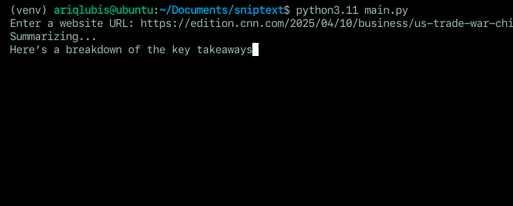

# 🕸️ Summarizer

A simple terminal-based tool that summarizes the main content of any website using Gemma 3 - 1B models. It streams the response in real-time — just like ChatGPT!

## 📹 Demo



---

## ⚙️ Installation
### 1. Clone the Repository
```bash
git clone https://github.com/yourusername/sniptext.git
cd sniptext
pip install -r requirements.txt
```

### 2. Install depedencies
```bash
pip install .
```

### 3. Usage

```bash
sniptext https://en.wikipedia.org/wiki/Natural_language_processing

```
